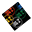
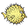

# operating-system-logos
Operating system logos in different sizes 

## Installation

```
npm i @egoistdeveloper/operating-system-logos
```

## Available Sizes

- 16x16
- 24-x24
- 32x32
- 48x48
- 64x64
- 128x128

## List of operating system names and custom short codes
Image files are named according to these titles (*see the **[reference](https://github.com/matomo-org/device-detector/blob/c136bf9147bd8f33746b1915331fba133d076ed5/Parser/OperatingSystem.php#L30)***). Current and frequently used logos defining operating systems were selected. Therefore, the version or naming differences were ignored when listing.

❌ unavailable\
✅ available\
⭕ not completed


## Preview List

| Preview | Code | Name | Status |
| ------- | ---- | ---- | ------ |
|  | AIX | AIX | ✅ |
|  | AND | Android | ✅ |
|  | AMG | AmigaOS | ✅ |
|  | ATV | Apple TV | ✅ |
|  | ARL | Arch Linux | ✅ |
|  | BTR | BackTrack | ✅ |
|  | SBA | Bada | ✅ |
|  | BEO | BeOS | ✅ |
| ............ | BLB | BlackBerry OS | ❌ |
| ............ | QNX | BlackBerry Tablet OS | ❌ |
| ............ | BMP | Brew | ❌ |
|  | CES | CentOS | ✅ |
|  | COS | Chrome OS | ✅ |
|  | CYN | CyanogenMod | ✅ |
|  | DEB | Debian | ✅ |
| ............ | DFB | DragonFly | ⭕ |
|  | FED | Fedora | ✅ |
|  | FOS | Firefox OS | ✅ |
| ............ | FIR | Fire OS | ⭕ |
|  | BSD | FreeBSD | ✅ |
|  | GNT | Gentoo | ✅ |
| ............ | GTV | Google TV | ❌ |
|  | HPX | HP-UX | ✅ |
|  | HAI | Haiku OS | ✅ |
| ............ | IRI | IRIX | ❌ |
| ............ | INF | Inferno | ❌ |
|  | KOS | KaiOS | ✅ |
|  | KNO | Knoppix | ✅ |
|  | KBT | Kubuntu | ✅ |
|  | LIN | Linux | ✅ |
|  | LBT | Lubuntu | ✅ |
| ............ | VLN | VectorLinux | ❌ |
|  | MAC | Mac | ✅ |
|  | MAE | Maemo | ✅ |
|  | MDR | Mandriva | ✅ |
|  | SMG | MeeGo | ✅ |
| ............ | MCD | MocorDroid | ❌ |
|  | MIN | Mint | ✅ |
| ............ | MLD | MildWild | ❌ |
| ............ | MOR | MorphOS | ❌ |
|  | NBS | NetBSD | ✅ |
| ............ | MTK | MTK / Nucleus | ❌ |
|  | WII | Nintendo | ✅ |
| ............ | NDS | Nintendo Mobile | ❌ |
|  | OS2 | OS/2 | ✅ |
| ............ | T64 | OSF1 | ❌ |
|  | OBS | OpenBSD | ✅ |
|  | PSP | PlayStation Portable | ✅ |
|  | PS3 | PlayStation | ✅ |
|  | RHT | Red Hat | ✅ |
|  | ROS | RISC OS | ✅ |
|  | REM | Remix OS | ✅ |
| ............ | RZD | RazoDroiD | ❌ |
|  | SAB | Sabayon | ✅ |
|  | SSE | SUSE | ✅ |
|  | SAF | Sailfish OS | ✅ |
|  | SLW | Slackware | ✅ |
|  | SOS | Solaris | ✅ |
|  | SYL | Syllable | ✅ |
|  | SYM | Symbian | ✅ |
|  | SYS | Symbian OS | ✅ |
|  | S40 | Symbian OS Series 40 | ✅ |
|  | S60 | Symbian OS Series 60 | ✅ |
|  | SY3 | Symbian^3 | ✅ |
|  | TDX | ThreadX | ✅ |
|  | TIZ | Tizen | ✅ |
|  | UBT | Ubuntu | ✅ |
| ............ | WTV | WebTV | ❌ |
|  | WIN | Windows | ✅ |
|  | WCE | Windows CE | ✅ |
|  | WIO | Windows IoT | ✅ |
|  | WMO | Windows Mobile | ✅ |
|  | WPH | Windows Phone | ✅ |
|  | WRT | Windows RT | ✅ |
|  | XBX | Xbox | ✅ |
|  | XBT | Xubuntu | ✅ |
|  | YNS | YunOs | ✅ |
|  | IOS | iOS | ✅ |
| ............ | POS | palmOS | ⭕ |
|  | WOS | webOS | ✅ |


## Json List

```json
{
    "AIX": "AIX ✅",
    "AND": "Android ✅",
    "AMG": "AmigaOS ✅",
    "ATV": "Apple TV ✅",
    "ARL": "Arch Linux ✅",
    "BTR": "BackTrack ✅",
    "SBA": "Bada ✅",
    "BEO": "BeOS ✅",
    "BLB": "BlackBerry OS ❌",
    "QNX": "BlackBerry Tablet OS ❌",
    "BMP": "Brew ❌",
    "CES": "CentOS ✅",
    "COS": "Chrome OS ✅",
    "CYN": "CyanogenMod ✅",
    "DEB": "Debian ✅",
    "DFB": "DragonFly ⭕",
    "FED": "Fedora ✅",
    "FOS": "Firefox OS ✅",
    "FIR": "Fire OS ⭕",
    "BSD": "FreeBSD ✅",
    "GNT": "Gentoo ✅",
    "GTV": "Google TV ❌",
    "HPX": "HP-UX ✅",
    "HAI": "Haiku OS ✅",
    "IRI": "IRIX ❌",
    "INF": "Inferno ❌",
    "KOS": "KaiOS ✅",
    "KNO": "Knoppix ✅",
    "KBT": "Kubuntu ✅",
    "LIN": "Linux ✅",
    "LBT": "Lubuntu ✅",
    "VLN": "VectorLinux ❌",
    "MAC": "Mac ✅",
    "MAE": "Maemo ✅",
    "MDR": "Mandriva ✅",
    "SMG": "MeeGo ✅",
    "MCD": "MocorDroid ❌",
    "MIN": "Mint ✅",
    "MLD": "MildWild ❌",
    "MOR": "MorphOS ❌",
    "NBS": "NetBSD ✅",
    "MTK": "MTK / Nucleus ❌",
    "WII": "Nintendo ✅",
    "NDS": "Nintendo Mobile ❌",
    "OS2": "OS/2 ✅",
    "T64": "OSF1 ❌",
    "OBS": "OpenBSD ✅",
    "PSP": "PlayStation Portable ✅",
    "PS3": "PlayStation ✅",
    "RHT": "Red Hat ✅",
    "ROS": "RISC OS ✅",
    "REM": "Remix OS ✅",
    "RZD": "RazoDroiD ❌",
    "SAB": "Sabayon ✅",
    "SSE": "SUSE ✅",
    "SAF": "Sailfish OS ✅",
    "SLW": "Slackware ✅",
    "SOS": "Solaris ✅",
    "SYL": "Syllable ✅",
    "SYM": "Symbian ✅",
    "SYS": "Symbian OS ✅",
    "S40": "Symbian OS Series 40 ✅",
    "S60": "Symbian OS Series 60 ✅",
    "SY3": "Symbian^3 ✅",
    "TDX": "ThreadX ✅",
    "TIZ": "Tizen ✅",
    "UBT": "Ubuntu ✅",
    "WTV": "WebTV ❌",
    "WIN": "Windows ✅",
    "WCE": "Windows CE ✅",
    "WIO": "Windows IoT ✅",
    "WMO": "Windows Mobile ✅",
    "WPH": "Windows Phone ✅",
    "WRT": "Windows RT ✅",
    "XBX": "Xbox ✅",
    "XBT": "Xubuntu ✅",
    "YNS": "YunOs ✅",
    "IOS": "iOS ✅",
    "POS": "palmOS ⭕",
    "WOS": "webOS ✅"
}
```


## Legal
All logos and trademarks are the property of their respective owners!
If you represent the entity that has the rights over a logo and you want, for whatever reason, that logo removed from this project, **[open an issue](https://github.com/EgoistDeveloper/operating-system-logos/issues/new)** requesting its takedown and we will remove it as soon as possible.